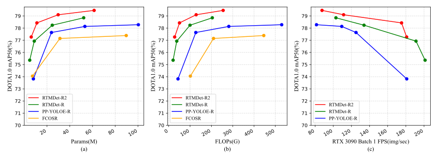

# RTMDet-R2

---

> RTMDet-R2：An Improved Real-Time Rotated Object Detector

## Abstract

---

Object detection in remote sensing images is challenging due to the absence of visible features and variations in object orientation. Efficient detection of objects in such images can be achieved using rotated object detectors that utilize oriented bounding boxes. However, existing rotated object detectors often struggle to maintain high accuracy while processing high-resolution remote sensing images in real time. In this paper, we present RTMDet-R2, an improved real-time rotated object detector. RTMDet-R2 incorporates an enhanced path PAFPN to effectively fuse multi-level features and employs a task interaction decouple head to alleviate the imbalance between regression and classification tasks. To further enhance performance, we propose the ProbIoU-aware dynamic label assignment strategy, which enables efficient and accurate label assignment during the training. As a result, RTMDet-R2-m and RTMDet-R2-l achieve 79.10% and 79.46% mAP, respectively, on the DOTA 1.0 dataset using single-scale training and testing, outperforming the majority of other rotated object detectors. Moreover, RTMDet-R2-s and RTMDet-R2-t achieve 78.43% and 77.27% mAP, respectively, while achieving inference frame rates of 175 and 181 FPS at a resolution of 1024×1024 on an RTX 3090 GPU with TensorRT and FP16-precision. Furthermore, RTMDet-R2-t achieves 90.63/97.44% mAP on the HRSC2016 dataset. The code and models are available at https://github.com/Zeba-Xie/RTMDet-R2.



## Results and Models

---

### DOTA 1.0

|Backbone|Pretrain|Aug|mmAP|mAP75|mAP50|Params(M)|FLOPs(G)|TRT-FP16-FPS|Config|Download|
| :--------: | :--------: | :---: | :-----: | :-----: | :-----: | :---------: | :--------: | :------------: | :------: | :--------: |
|RTMDet-t|IN|RR|47.71|51.00|77.27|6.19|27.74|181|[config](configs/rtmdet-r2/dota/t-3x.py)|[model](https://pan.baidu.com/s/1vlG2SX6Q6dJblllfVPH8uQ)|
|RTMDet-s|IN|RR|48.81|51.66|78.43|11.17|50.50|175|[config](configs/rtmdet-r2/dota/s-3x.py)|[model](https://pan.baidu.com/s/1IAWXCU2_NsBlR4Al01RJVQ)|
|RTMDet-m|IN|RR|51.08|55.03|79.10|29.84|128.55|111|[config](configs/rtmdet-r2/dota/m-3x.py)|[model](https://pan.baidu.com/s/167_7tigmseQx0cGDvA3LoQ)|
|RTMDet-l|IN|RR|51.13|56.18|79.46|61.44|255.23|88|[config](configs/rtmdet-r2/dota/l-3x.py)|[model](https://pan.baidu.com/s/1s-JFgZU2i41ma4vFDY2MSw)|

* By default, DOTA 1.0 dataset trained with 3x schedule and image size 1024*1024.
* The FPS test is conducted on 10832 images in the DOTA 1.0 test set to calculate the average value.

### HRSC2016

|Backbone|Pretrain|Aug|mAP-07|mAP-12|Params(M)|FLOPs(G)|TRT-FP16-FPS|Config|Download|
| :--------: | :--------: | :---: | :------: | :------: | :---------: | :--------: | :------------: | :------: | :--------: |
|RTMDet-t|IN|RR|90.63|97.44|6.19|16.91|231|[config](configs/rtmdet-r2/hrsc/t-9x.py)|[model](https://pan.baidu.com/s/133jnFCjYreqMcf7cMNC36Q)|

* By default, HRSC2016 dataset trained with 9x schedule and image size 800*800.
* The FPS test is conducted on 443 images in the HRSC2016 test set to calculate the average value.

**Note**:

1. We follow the latest metrics from the DOTA evaluation server, original voc format mAP is now mAP50.
2. ​`IN`​ means ImageNet pretrain. RR means Random rotate and Flip.
3. The inference speed is measured on an NVIDIA 3090 GPU with TensorRT 8.4.3, cuDNN 8.3.2, FP16, batch size=1, and with NMS.
4. The extraction code of BaiduYun is `6666`.

## Citation

---

```txt
Xiang H, Jing N, Jiang J, et al. RTMDet-R2：An Improved Real-Time Rotated Object Detector[C]// The 6th Chinese Conference on Pattern Recognition and Computer Vision (PRCV). Cham: Springer International Publishing, 2023: 352-364.
```

‍
